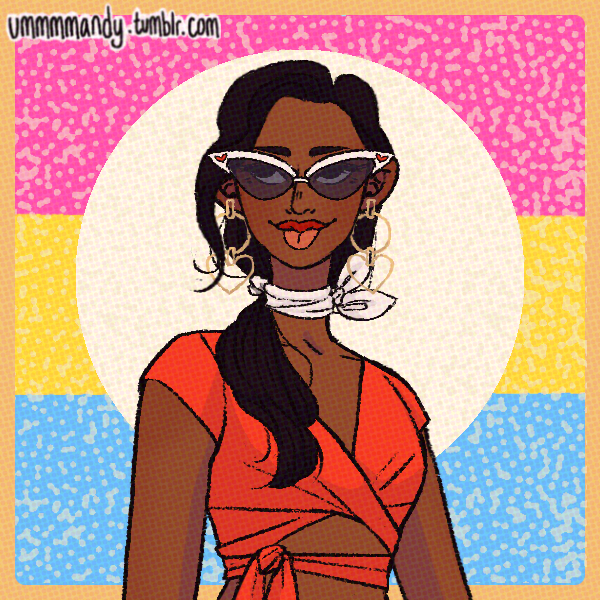

> [!QUOTE|right] The \_\_\_\_ one
> {: .bio-portrait}
> *"Cheesy Quote"*{: .bio-quote}

# **Aliya Raventhorne**{: .bio-page-title}

## **Bio**{: .bi-section-title}

This is Aliya Raventhorne, Y2K it girl, old money more like ANCIENT money, huuuge vampire family with mansions taking up an entire block. she was turned into a vampire and officially inducted into the immortal part of the family a couple months ago, on her 16th birthday. she feels her humanity slipping away and is desperate to hold onto it. she is also desperate to fit in with her family, who are very pro-humanity-slipping-away. 

she’s a fashionista. she’s a plant mom. she runs a blog. she’s on the track team. straight B student. 

anyway she’s sort of keeping the vampire thing on the down low, but Trish is being really annoying about it.

Easily sunburnt and light sensitive, silver burns her. Vampires age extra slowly so she will be in her 50s before she looks like she's in her 20s.

> [!INFO|left] Quick Facts
> - Player: Tess
> - Skin: Vampire
> - Pronouns: She/Her
> - Age: 16
> - Height: Somehow shorter than her Player
> - Fun fact:

## **Main Character Connections**{: .connections-title}

[link](.md) - Blah blah blah

No one... Yet ;)