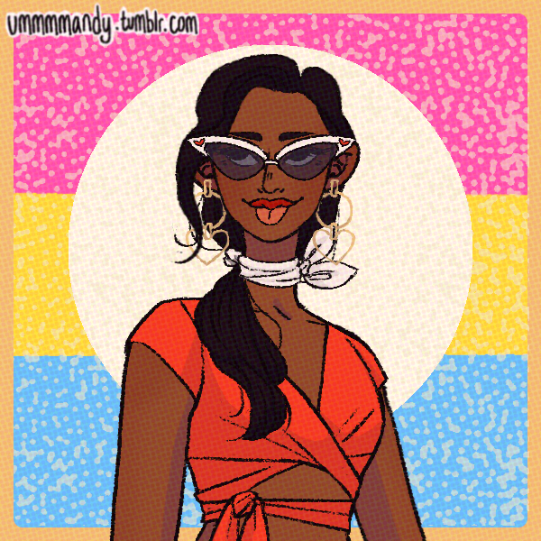

> [!QUOTE|right] The \_\_\_\_ one
> {: .bio-portrait}
> *"Cheesy Quote"*{: .bio-quote}

# **Aliya Raventhorne**{: .bio-page-title}

## **Bio**{: .bio-section-title}

This is Aliya Raventhorne, Y2K it girl, old money more like ANCIENT money, huuuge vampire family with mansions taking up an entire block. She was turned into a vampire and officially inducted into the immortal part of the family a couple months ago, on her 16th birthday. She feels her humanity slipping away and is desperate to hold onto it. She is also desperate to fit in with her family, who are very pro-humanity-slipping-away. 

She's a fashionista. She's a plant mom. She runs a blog. She's on the track team. straight B student. 

anyway she’s sort of keeping the vampire thing on the down low, but Trish is being really annoying about it.

Easily sunburnt and light sensitive, silver burns her BAD. Vampires age extra slowly so she will be in her 50s before she looks like she's in her 20s.

> [!INFO|left] Quick Facts
> - Player: Tess
> - Skin: Vampire
> - Pronouns: She/Her
> - Age: 16
> - Height: 5'1" (156cm)
> - Fun fact: her favorite musical artist is avril lavigne

## **Main Character Connections**{: .connections-title}

[Amy](El Adir.md) - Rivals! You've heard of enemies to lovers, now get ready for enemies to mortal enemies. Also Amy is (rather successfully) flirting with Trish and it would be devestating if she actually moved on from Aliya.

## Homeroom questions
**Who do you have a crush on? How long and how bad is it? (This can be more than one person esp if NPCs)**

Everette. Aliya thinks he’s super cute and super cool and loves how mysterious and hard-to-get he is. she loves when people play hard-to-get, because she knows she can get them. 

LC. see above. in addition to being hard-to-get and mysterious, they are also cold, which aliya views as an extra challenge. also, aliya has noticed that LC and Mars take go on smoke together, and she’s jealous. why would Mars get close to someone else? Is Mars trying to replace Aliya? Was losing Aliya (as a girlfriend) in 9th grade not the worst thing to ever happen to him? if Aliya can make LC fall in love with her, that’s killing two birds with one stone. 

Melody. so much more of a toxic crush than LC. Melody is too bubbly for Aliya; she doesn’t like the idea that someone would prefer Melody’s kindness to Aliya’s…. hmm. Melody makes Aliya feel inferior, especially because Zelda keeps flirting with her. is Aliya not good enough? so i guess this is less of a crush and more of a conquest 

Cleo. Cleo is not Aliya’s typical type. Fae keep flirting with her, and he’s a cutie pie. this is definitely Aliya’s most normal and healthy crush, not that she knows or can tell a difference. why does she want him to keep tapping her shoulder, to keep passing her notes, to keep whispering about random shit outside the window? it’s annoying… right? one time, cleo was absent, and aliya’s heart was chained down and dragged underwater, but she was probably just hungry or something. (hey i think aliya is actually in love with cleo)

**Do you tutor Cleo in anything (Math, History, Science, or English)?**

Aliya is actually pretty good at English and tutors him in it. i mentioned previously that she was a solid B student, but she actually got a lot better at English for the express purpose of tutoring cleo efficiently. but i’m sure she thinks it’s just because she has a passion for the language, which isn’t out of the question. this girl has no idea how down bad she is for cleo.

**Why is Mars known to the local cops and what did you do to help him out of a tight scrape recently?**

Mars is known because he’s big on graffitiing the town. his mom is a lieutenant and they have a tumultuous relationship. mars has no siblings and his dad is out of the picture, so it’s just him and his mom. her uptightness and short leash is probably what pushes Mars to rebel. i also do not believe she respects mars’ pronouns.

very recently, mars was busted red handed for graffitiing city hall. he was taken into the station. at some point he managed to text aliya, and she trailed behind the cop car to the station. there, she ran in and sweet-talked his mother into letting him off with a warning. 

**Where do you hang out besides the nursery, who else is there besides the IT crew?**

the oh deer cafe is a popular hangout spot that welcomes teens to get some grub and sit down and hang out. there’s a swing set and a gazebo in the back. the IT crew frequent this place. i imagine many other NPCs would be there, but zelda tends to push the IT crew there at certain times, and melody just so happens to be working every time they go. aliya fully believes zelda memorized melody’s schedule. #zelody (edited)Tuesday, July 28, 2026 9:30 PM

**When’s the last time you had a sleepover, who was there and where was it?**

Aliya, Mars, and Hana had a sleepover in 6th grade after being grouped together for a science project. (this is when aliya met mars btw.) the three of them, for the science fair, chose to do [age-appropriate experiment involving plants; insert later]. for weeks, they got together on Fridays and put in a few hours of work before switching to video games and having a fun little sleepover at the nursery. the last one was the night before the fair.

**What scandalous secret from that sleepover would you prefer stay hidden?**

to celebrate the completion of their science project, aliya wanted to do something daring, so she took mars and hana to the crypts to explore and get lost. 

the group split up to play hide and seek. one of aliya’s relatives found hana, and not knowing who she was, attacked her and fed on her, heavily. she almost died before aliya found them. hana was rushed to the hospital and probably fed a diffferent story about what happened. 

(i think this short-lived friendship with hana happened soon after annalise’s accident, so hana was very vulnerable and in need of friendship. [edit: nvm i think annalise’s accident happened when they were young kids?] this incident broke their friendship and two year later, hana and christopher would form a bond, also from a science project lol. zelda doesn’t know what happened and there is still some lingering jealousy over the friendship she was not apart of. i think zelda is a little catty to hana. mars was not there and does not know the real story and was fed the same story that hana was.) 

**Also follow up question but what did you do that got you put on the recycling team for a month to escape a suspension?**

okay got it. in a revenge plot for Amy kicking Zelda’s ass, we took inspiration from Carrie and rigged Amy’s locker to splurt blood at her, which aliya has access to, of course. IT WORKED I DECIDED but she absolutely did not get away with it because the blood drive place noticed the blood missing and that’s literally a crime?? though since her family runs it, they looked the other way, but aliya got an earful and a huge punishment at home. 

the punishment included [Morwenna](_adults.md#Morwenna Raventhorne) telling the school that Aliya solely was responsible for the prank. hence the suspension. morwenna was also the one to talk them down from a suspension lmao

