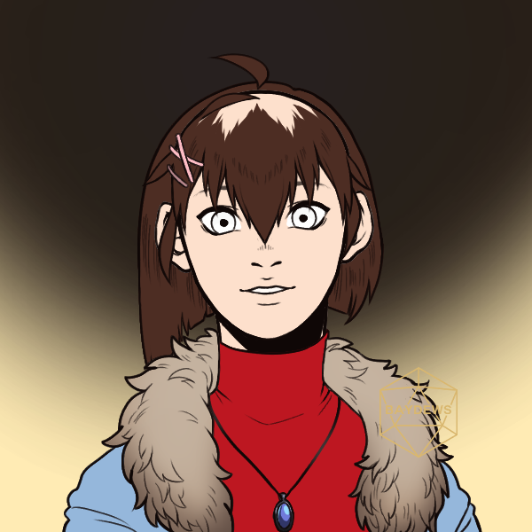

![[merrymont.png | 300]]

She/Her

> [!QUOTE|right] The \_\_\_\_ one
> {: .bio-portrait}
> *"Cheesy Quote"*{: .bio-quote}

# **Alyssa Merrymont**{: .bio-page-title}

## **Bio**{: .bi-section-title}

"Adventure Party at the End of the World" was a game that did not sell very well. Critics derided it for its unrealistic depictions of characters and shallow story - a princess joining a group of knights going to stop a deity who was attempting to take over the world and bring peace through conquest, who would buy that as a realistic concept? Still, the game sold well enough to somehow be approved for a sequel, and under pressure to make it perform, it became much more 'generic', and in doing so, somehow managed to sell much better. One of the main heroines, Everlyn Merrymont, was a favorite among fans... who only liked her once she became weak, helpless, and nothing but a bumbling idiot who fawned over the main character. This caused many people to post their own stories and theories about her online, on message boards, on forums, depicting her in a myriad of different ways, in relationships with everyone, going through pleasure and pain. And one day, Evelyn simply.. appeared in the real world. Memories of her 'original' story laid in her head before a flood of every story, bad poem, scathing review, and creepy message bombarded her head. She barely managed to stay conscious, and now had to figure out what she was going to do. Her memories gave her a general idea of how this world worked, but now... she was free, surely this time she could forage the path for herself that she wanted, not contstrained by the opinions of others.

> [!INFO|left] Quick Facts
> - Player: Izzie
> - Skin: Fable
> - Pronouns: She/Her
> - Age: 
> - Height: 
> - Fun fact

## **Main Character Connections**{: .connections-title}

No one... Yet ;)