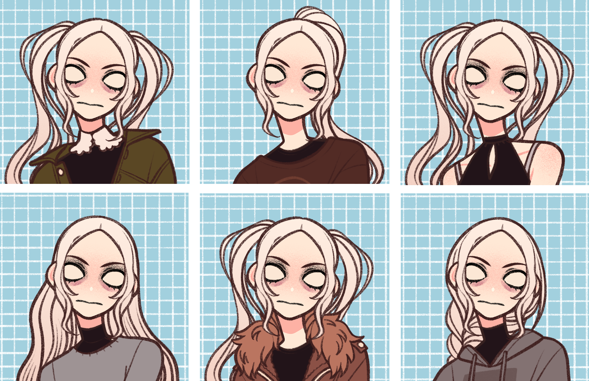

> [!QUOTE|right] The \_\_\_\_ one
> {: .bio-portrait}
> *"Cheesy Quote"*{: .bio-quote}

# **Annalise Devin**{: .bio-page-title}

## **Bio**{: .bio-section-title}

When she was young, Annalise began to see flashes of visions. Her favoured koi fish in the pond in her backyard died, which she saw coming, and later, when she began to have flashes of the accident which resulted in her losing her parents and her vision, she panicked a lot, but there was nothing her parents or older brother could do to calm her down. The accident, of course, happened. Afterwards, she smells death before it occurs, can see it coming. Annalise and her older brother now live on their grandmother's estate, having been left to the two after she passed. Annalise now uses her clairvoyance to get around, being visually impaired. How did she know how to find the bathrooms in the high school? She saw the school in a vision!

Older brother named [Lucas](_Adults.md#lucas-devin), going to college in the larger nearby town, maybe to become a shrink. Does live on their grandmother’s estate though, he’s maybe 23 so he commutes to the college 

> [!INFO|left] Quick Facts
> - Player: Karley
> - Skin: Banshee
> - Pronouns: She/Her
> - Age: 
> - Height: 
> - Fun fact:

{: .bio-portrait}

## **Main Character Connections**{: .connections-title}

[Everette](Everette Eerie.md) - Noticed how much he changed and how different he smells since the incident, would love to know why.

[Alyssa](Alyssa Merrymont.md) - This girl smells insane

## **Homeroom Answers**
**Who do you have a crush on? How long and how bad is it? (This can be more than one person esp if NPCs)**
I don’t think Annalise has a crush on anyone in our homeroom. If anything, maybe an upperclassman.

**Who does that person have a crush on?**
N/A

**Do you tutor Cleo in anything (Math, History, Science, or English)?**
Science, but Annalise is only nominally better in that class than anyone else. She just likes it, and tutoring others is as good a way as any to get some studying in for herself as well.

**When Chandra’s parents found out they were secretly dating [BLANK] they freaked tf out and made him break up with them, who was it and do you think there could still be a spark?**
“I thought I heard that Chandra was hanging out with Cleo a lot, but not so much recently. I can often hear Cleo coming up to ask our teacher questions. The thing is, Cleo isn’t a bad student or falling behind in any subjects though, so I wonder about it. Is Cleo just walking up to the front of the class so that he can pass by Chandra’s desk?” 

**You’ve heard a rumor about Hana and the music teacher getting together.. Do you think it’s true? She certainly has a thing for authority figures**
It doesn’t seem like her from the Hana that Annalise knew back before her accident, but plenty may have happened when they briefly fell apart, and it’s not like Annalise knows the current Hana as well as she used to. Annalise isn’t sure about this rumor, but she doesn’t want to be so bold as to ask Hana about it outright. If Hana’s offended, it might damage their newly rekindling friendship. 

**Why do you think LC is late to homeroom every morning?**
“I think I heard them telling some other classmates that they were out smoking behind the fence near the woods, but then I also heard them telling a teacher that their parents just had a baby daughter a few months ago and they were helping the nanny to get her to stop crying.”

**Who’s the last person you hung out with outside of school or extracurriculars, where did you go and what did you do?**
“Christopher came to meet me out at the [neighbouring town] ice rink after my practice. We got burritos. Lucas was gonna be out at a late class that day, so I didn’t have to worry about being home for dinner.” 

**Pick 3 NPCs to be on the recycling team, you can be on it as well if you want. Also pick one PC that has to participate in it for a month as community service instead of a suspension**
Mars
Lance
Christopher
Aliya probably got it as community service.