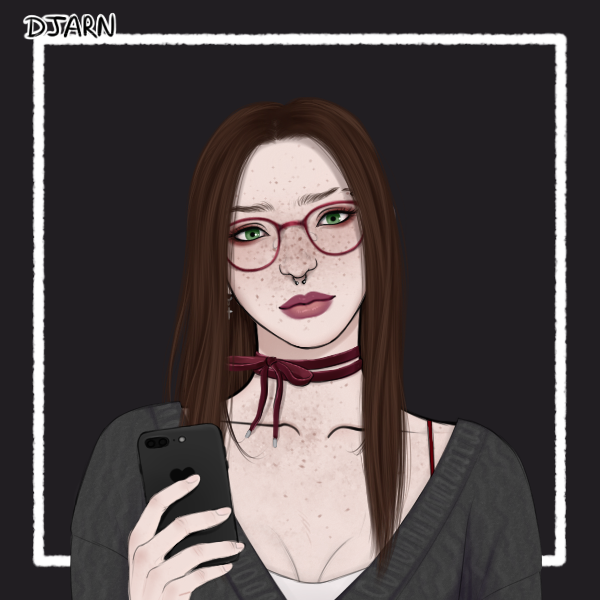

# Amy McCarthy

> [!QUOTE|right] The \_\_\_\_ one
> {: .bio-portrait}
> *"Cheesy Quote"*{: .bio-quote}

# **Amy McCarthy**{: .bio-page-title}

## **Bio**{: .bio-section-title}

Bio goes here

> [!INFO|left] Quick Facts
> - Player: Phoenix
> - Skin: ???
> - Pronouns: She/They
> - Age: 
> - Height: 
> - Fun fact

## **Main Character Connections**{: .connections-title}

[Everette](Everette Eerie.md) - ???

[Graye](Graye Wilde.md) - Good friends, fake werewolf

## **Homeroom Answers**

**Who do you have a crush on? How long and how bad is it? (This can be more than one person esp if NPCs)**

Amy is a mega slut and is gonna try and fuck everybody, she generally finds most people attractive but has a few crushes that make her feel butterflies in her stomach. For “Amy’s” crushes:

This is so heavily redacted, you have no idea y'all. Maybe you'll be lucky enough to see it one day.

**Calvin**, Very recently, small crush but growing fast. Amy usually has a pretty quick sense for who people are, but Calvin constantly eludes her. She doesn’t know why but she’s drawn to him and the hidden loneliness behind his eyes.

**Everette**. Since Amy first met him while she was \[REDACTED\], big crush but doesn’t want to admit it. Everette is usually quiet and stoic from Amy’s perspective, never tries to be cruel to anybody even though he had a bitch for a gf. Amy was extra motivated to \[REDACTED\] anytime he wasn’t around.

**Alyssa**. Very recently and growing steadily. I’m still unsure if Amy knows about the video game or not, but regardless there’s a connection Amy feels with her. When Amy finds herself around Alyssa, she doesn’t feel so alone in her feelings of “not belonging here,” and it brings her strange comfort.

**Graye**, since they first met. Amy is confused about her feelings for Graye. She loves how protective they are, and how strong and wild they are. Amy feels safer any time they’re around… but also scared they’ll find out the truth. Amy likes being in a pack and doesn’t want that to end.

**Who does that person have a crush on?**

For the PCs, I dunno who they all have crushes on, but for the others:

\[REDACTED\]

Calvin most likely has a crush on Amy too, but he’s so distant and quiet it’s hard to tell who he actually likes.
 

**"Amy" seems like a menace, who is on her shit list and should watch their back after last week?**

For Amy’s shit list, take a wild guess, Aliya is always at the top, but recently someone else has distracted her from her. 

Zelda has recently caught Amy’s ire after a fight they had in the girls change room last week. Nobody knows exactly what happened in there, the door somehow got locked and it ended before a teacher was able to barge in and confront them. But when the two of them left, Zelda was fully clothed and soaking wet, her phone also got soaked, the people who were there to spectate say she even smelled like shit after. 

Whatever happened in there it seemed to leave its mark on Zelda, she’s avoided all eye contact with Amy since and insists she was just being dramatic. Unlike Zelda however, Amy seemed untouched and unfazed by the entire encounter.

**You’ve noticed someone in class changing a lot recently, who and what changes?**

Amy tends to be very aware of the people around her, their personalities, and their physicalities, but lately there’s been a student undergoing some more drastic changes lately. 

**Lance** has been acting much more confident lately, and moreover, he’s been filling out that stupid hoodie he wears all the time; he’s getting buff. It’s doubtful he works out at the school gym, but whatever he’s doing is working, and suspiciously well too.

**Why does the local sheriff know Amy’s name?**

The sheriff of Oak Vale, **Sebastian Lukas**, first met “Amy” during the heaviest thunderstorm of last summer. He found her trapped on the edge of the river as it was beginning to flood. “Amy” had been camping there and wasn’t able to move fast enough to avoid the storm that tore through Oak Vale in the middle of the night. Sebastian got a call that someone had been spotted struggling on the river bank and needed urgent help, he ended up being the first on scene and let her sleep in the station after rescuing her from this perilous situation. 

Sebastian became a bit worried about “Amy” after this incident, understanding that “Amy” probably doesn’t have any family in town. \[REDACTED\].

**Who did you see Calvin walking down your street with the other day? It sure looked like they were having fun**

\[REDACTED\] “Amy,” took a stroll around her street and bumped into Calvin and Lance. The two of them were too wrapped up in their conversation to notice "Amy," who was purposefully dressed in very plain and unassuming attire. After the small collision, the two of them apologized and laughed it off, before returning to their walking conversation about a “DnD campaign” that Calvin is running and wants more players for. "Amy" so badly wanted to stop them and ask to join, but decided against it; because after all, \[REDACTED\]

**Is Amy currently hooking up with any NPCs?**

Here’s a list of everyone that "Amy" has been sleeping with:

**Trish** - “Amy” has been seeing Trish as often as she can, and as often as Trish allows. “Amy” treats Trish with a tenderness and welcoming that makes her feel attractive, beautiful and sexy. But there might be some alternative motives behind this attraction.
**LC** - An ongoing fling that finds the time and space to happen just about anywhere the two are near each other.
**Mars** - It’s fun to fuck while high, so why not sleep with your dealer?
**Cleo** - The best source of gossip usually happens in the bedroom, especially when it’s Cleo’s bedroom.
**Chris & Hana** - These two are just a source of very fun and freaky entertainment. Sometimes, it’s fun to be the third.

**You currently owe someone in class a huge favor despite hating their guts, who?**

“Amy” doesn’t really like LC, they're just way too much of a poser for “Amy” to take seriously. But regardless of how “Amy” feels, LC will be \[REDACTED\]. 

Among the numerous times “Amy” and LC have “hung out,” they came to \[REDACTED\]. LC is willing to \[REDACTED\] “Amy” \[REDACTED\], but only after \[REDACTED\].

*fin*

