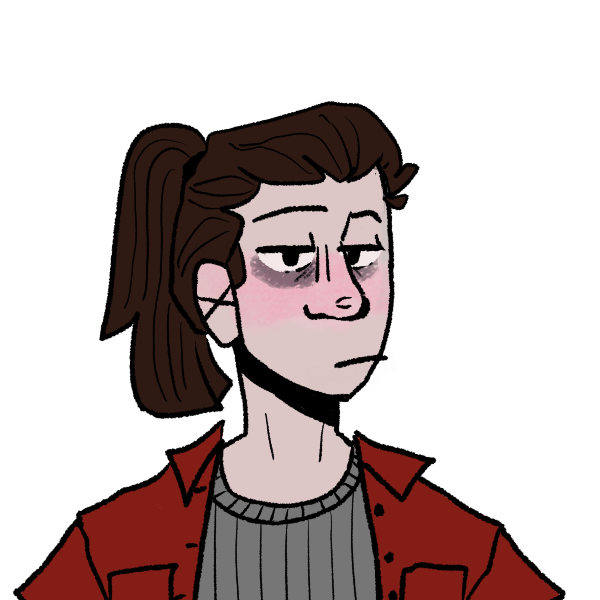

> [!QUOTE|right] The \_\_\_\_ one
> {: .bio-portrait}
> *"Skate or die bro. You either skate; or you die."*{: .bio-quote}

# **Everette Eerie**{: .bio-page-title}

## **Bio**{: .bio-section-title}

Meet Everette Eerie, 17yo former Volleyball star. After an accident that happened around a year or more prior to the story he died, but is still walking the earth as a GHOUL! He now has an insatiable hunger to remember what happened to him and how he died. Along with what happened to his mother and why his father has so drastically changed for the worse.

Dated Petunia for a long time and tbh still wants her back

Has become increasingly withdrawn and socially isolated.

> [!INFO|left] Quick Facts
> - Player: Jon
> - Skin: Ghoul
> - Pronouns: He/Him
> - Age: 17
> - Height: 
> - Fun fact

## **Main Character Connections**{: .connections-title}

[Amy](El Adir.md) - ???

No one... Yet ;)

## **Homeroom Answers**

**Who do you have a crush on? How long and how bad is it? (This can be more than one person esp if NPCs)**

Everette still has feelings for his ex Petunia Petunia (lovingly referred to as P² ) but has accepted the fact that shes probably not interested in him anymore. Regardless has been holding onto these feelings for the last 2-3 years and thats the big one and only confirmed relationship hes had

He also probably has a small crush on Aliya. I imagine back when he was on the volley ball team he would go to parties that she hosted/attended and saw her quite frequently, even if they didnt interact. Def was impressed with her running tho and various other talents. I think she was the first girl he started looking at after he started accepting that P² wouldnt want him back. 

"Idk what it is about this new student Amy that keeps catching my eye" Mild interest because their so new and at this point Everette is standofish but hes like "woah pretty" 

Everette is suppressing feelings for Tyler Crater who was his best friend while he was on the volleyball team. They were close would play video games and skateboard together to practice all the time, but after Everette started secluding himself and Tyler started messing with him hes extra conflicted about these things. 

He's also suppressing feelings about Mars. Eve just thinks hes an attractive person and notices how they roller skate so if he was to become friends with him they could bond with that. Also knows they do the weed and is semi interested in starting that lol.

**Do you tutor Cleo in anything (Math, History, Science, or English)?**
Everette doesn't have the best grades, but before his mother passed she made sure to make him sit down and study for a number of hours a week. She was a scientist so thats what she helped him the most in so his best class is science begrudgingly. I dont think he wants to tutor anyone, but maybe hes forced to tutor Cleo in science to make up for missing classes for extra credit or something.

**Who actually laughs when Tyler Crater throws things at you?**
When Tyler is messing with me the one who's laughing is Streeter. Everyone else in the class doesnt really seem to care unless someone who has made an npc thinks otherwise

**Where do you go for the peaceful vibes when home is too much? Who did you see there last time and what did they do that was surprisingly tender?**
When home is too much Everette usually goes to any near by skate park, of if there isnt any just some abandond building where he can practice grinding on handrails. The last person he met there was probably Trish, who followed him to question him for the paper. I imagine after that she would occasionally just show up to hang out with him and talk. Thats how they started becoming closer and he starts opening up more
*I like to think Trish is his first real friend after the incident*

**Trish has gone to some great lengths to peek in your book, what was a recent one that (almost) crossed the line?**
SPEAKING of Trish the most recent thing she read that almost crossed the line was probably a paper article that Everette ripped straight out of a news paper and taped into his note book. She saw the article specifically mention his mother. She didnt get to read the whole thing before Everette snatched it out of her hand but underneath it he had some connected memories and question marks that he thought were moments right before the incident

**Why do you think so poorly of Zelda Crowe?**
Everette doesnt like Zelda because shes mean to Trish. He doesn't say anything tho probably because he has a crush on Aliya and Mars

**You know one of Chris Halston's secrets, what is it?**
Back when the incident happened, Everette was hospitalized for a bit and while he was there he happened to find out that Halston has a close family member, like a parent or sibling, who has some chronic disease and hes been working to help pay for treatments and stuff.
His family member is still undergoing treatment, but Halston is unaware that Everette knows cause the only reason he knows is that he overheard a conversation from down the hall those years ago
Halston is a very chatty guy, just not about his family or personal troubles