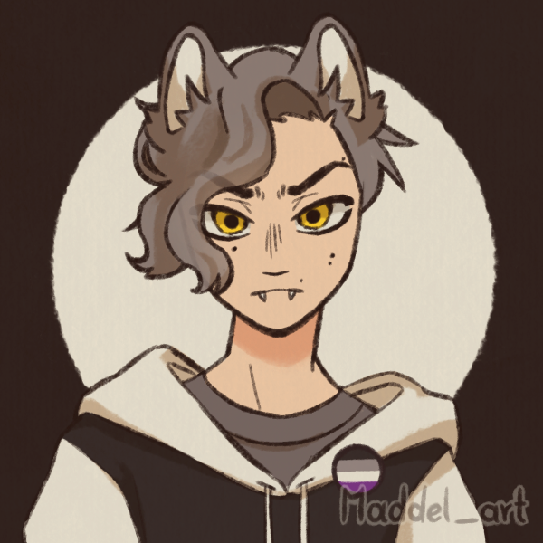

![[graye_teen.png | 300]]

> [!QUOTE|right] The wild one
> {: .bio-portrait}
> *"The lone wolf is the one that survives. It's the one that knows how to fend for itself."*{: .bio-quote}

# **Graye Wilde**{: .bio-page-title}

## **Bio**{: .bio-section-title}

This is Graye Wilde (16, nb, they/them). They got turned into a werewolf while wandering in the woods at a crappy religious summer camp their parents sent them too. Now they think they're super badass and cool and definitely aren't anxious at all.

Graye initially tried to keep it a secret but their parents found out when they transformed to catch their mom after she fell off a ladder. Their parents are trying to be accepting but are a little out of their depth. Graye doesn't blame their parents and mostly thinks being a werewolf is the coolest thing ever.

Their parents, Sue and Harold Wilde, are well-meaning people who do try their best but ultimately struggle with connecting with Graye. They aren't churchgoing but are still kinda religious. They accept Graye for being nb, pan, and ace even if they don't get it and are struggling to accept the werewolf thing too. Graye tends to get into fights with their parents more now that they are a werewolf, especially with their dad.

[https://open.spotify.com/playlist/6z2KqsEWVJ1WohD06XTIqG?si=xxsZ3wWpQvy5rPJhleP_5g&pi=iQQw2DtRQ9-FG](https://open.spotify.com/playlist/6z2KqsEWVJ1WohD06XTIqG?si=xxsZ3wWpQvy5rPJhleP_5g&pi=iQQw2DtRQ9-FG)

> [!INFO|left] Quick Facts
> - Player: Mouse
> - Skin: Werewolf
> - Pronouns: They/Them
> - Age: 16
> - Height: 5'7" (170cm)
> - Fun fact: They don't seem to be very chatty unless you bring up Zelda games...

## **Main Character Connections**{: .connections-title}

[Amy](El Adir.md) - Good friends

No one... Yet ;)