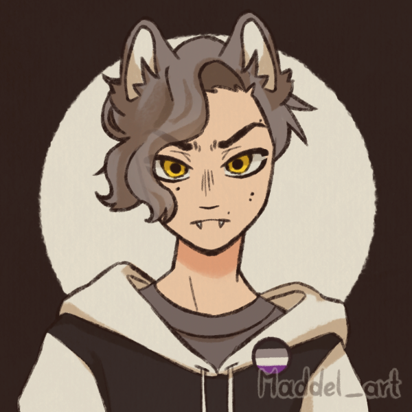

![[graye_teen.png | 300]]

> [!QUOTE|right] The wild one
> {: .bio-portrait}
> *"The lone wolf is the one that survives. It's the one that knows how to fend for itself."*{: .bio-quote}

# **Graye Wilde**{: .bio-page-title}

## **Bio**{: .bio-section-title}

This is Graye Wilde (16, nb, they/them). They got turned into a werewolf while wandering in the woods at a crappy religious summer camp their parents sent them too. Now they think they're super badass and cool and definitely aren't anxious at all.

Graye initially tried to keep it a secret but their parents found out when they transformed to catch their mom after she fell off a ladder. Their parents are trying to be accepting but are a little out of their depth. Graye doesn't blame their parents and mostly thinks being a werewolf is the coolest thing ever.

Their parents, Sue and Harold Wilde, are well-meaning people who do try their best but ultimately struggle with connecting with Graye. They aren't churchgoing but are still kinda religious. They accept Graye for being nb, pan, and ace even if they don't get it and are struggling to accept the werewolf thing too. Graye tends to get into fights with their parents more now that they are a werewolf, especially with their dad.

[https://open.spotify.com/playlist/6z2KqsEWVJ1WohD06XTIqG?si=xxsZ3wWpQvy5rPJhleP_5g&pi=iQQw2DtRQ9-FG](https://open.spotify.com/playlist/6z2KqsEWVJ1WohD06XTIqG?si=xxsZ3wWpQvy5rPJhleP_5g&pi=iQQw2DtRQ9-FG)

> [!INFO|left] Quick Facts
> - Player: Mouse
> - Skin: Werewolf
> - Pronouns: They/Them
> - Age: 16
> - Height: 5'7" (170cm)
> - Fun fact: They don't seem to be very chatty unless you bring up Zelda games...

## **Main Character Connections**{: .connections-title}

[Amy](El Adir.md) - Good friends, thinks Amy is a werewolf too!

## **Homeroom answers**

**Who do you have a crush on? How long and how bad is it? (This can be more than one person esp if NPCs)**

Graye has a crush on both LC and “Amy”. Their crush on LC started in the latter half of the previous school year. They always thought everything about LC was the coolest and felt a sort of kinship with them since they are both new to the area. The crush started when a teacher was clearly in the wrong about something and  LC brazenly talked back to him with a cool confidence Graye respected. The crush has only grown with time. However, aside from a few passing words Graye has never really worked up the nerve to talk to LC much. Hopefully LC hasn’t caught them staring…

Graye’s crush on “Amy” has just started. Their friendship grew quite quickly after Graye met Amy, a fellow werewolf, this summer but their unique bond has caused more romantic feelings to start forming. 

**Who does that person have a crush on?**

LC has a crush on Zelda (I think the punk/femme ship is cute) although plays it extremely cool around her to maintain their detached persona. LC initially thought of Zelda as the stereotypical shallow popular girl type. However, this changed when Zelda found LC in a secluded spot after school one day, clearly emotionally distraught about something. Not commenting on the change from their usual demeanour, Zelda provided a genuine source of comfort and compassion in this rare moment of vulnerability. No one else in the school knows this happened and LC appreciates Zelda keeping these events a secret. Since then, LC has developed a crush on Zelda.

Also Kat said LC and Graye might be a good fit  

**Why do you think LC is late to homeroom every morning?**

Graye, prone to flights of imagination, likes to think LC is secretly trying to spy on their parents before school and learn more about Brookhaven National Laboratory. It’s fun to think about LC secretly putting together all the strange goings-ons that must be occurring at BNL.

Realistically, Graye assumes they just can’t be bothered to show up to homeroom on time because they’re too cool for school. 

**Why do you hate Hana Marin so much?**

For Graye, Hana is one of those people who just rubs you the wrong way. She and Graye have polar opposite tastes in music and she is vocal about not liking the music Graye is into. Not only is this really annoying to Graye, it also makes it hard for Graye to talk to Christopher about music if she’s hanging around him. These mild annoyances have added up to a general dislike of Hana which has worsened now that Graye is a werewolf and they are quicker to anger.

**What did you do to make Tyler Crater dislike you so much?  Why does Chandra Mohdi tolerate sitting next to him even after everything he's done?**

Tyler hates Graye after Graye made him look uncool in front of his other friends. Near the end of the summer (after Graye had become a werewolf), Tyler and his friends spotted them standing alone outside the general store, texting someone and clearly not noticing the approaching group. 

Deciding to have a bit of fun, Tyler went up to Graye and deliberately stepped quickly into their personal space with the intention of making them flinch. Rather than flinching, a feral look came into Graye’s eyes and their face took on a slightly more animalistic look (ie. sharper teeth) as they snarled back. Not expecting the resistance and certainly not expecting this slight shift in appearance, Tyler made a rather undignified noise of alarm and quickly stepped back. He had been unintentionally blocking Graye from his friends’ view so none of them saw what happened aside from Tyler being the one to immediately back down. They immediately laughed at Tyler, who was deeply embarrassed, and occasionally bring the incident up to piss him off. Since then Tyler has borne a grudge against Graye but hesitates to mess with them.

Chandra is extremely closeted gay in high school and secretly has a crush on Tyler that he is loathe to admit even to himself. He instead comes up with a million different excuses for Tyler’s behaviour (perhaps a bad home life, typical teen boy behaviour, etc). If asked directly, Chandra will say addressing the behaviour of someone like Tyler is simply beneath him and his academic goals.

**Do you tutor Cleo in anything (Math, History, Science, or English)?**

Graye doesn’t tutor Cleo in anything. Graye doesn’t do well enough in school to tutor anyone, would not be interested in it, and generally doesn’t fully vibe with Cleo. Graye doesn’t care much for gossip and quite frankly doesn’t know how to handle faer constant flirting. Their awkwardness with the flirting may result in Graye snapping at Cleo if he pushes it too much.

**Who or what did you see surprisingly far out into the forest recently?**

Graye saw Trish surprisingly far out in the forest in an attempt to find cryptids. Graye was running around as a wolf when they heard her crashing through the brush. She was well off the main trail and Graye knew a bear was in the area, so they made a lot of noise in the underbrush to scare her back to the trail. 

Graye succeeded in getting her to leave the woods safely but this had the unintended consequence of Trish wanting to join them in the woods. Trish thinks Graye just goes on hikes or something and wants to join them since there’s safety in numbers!