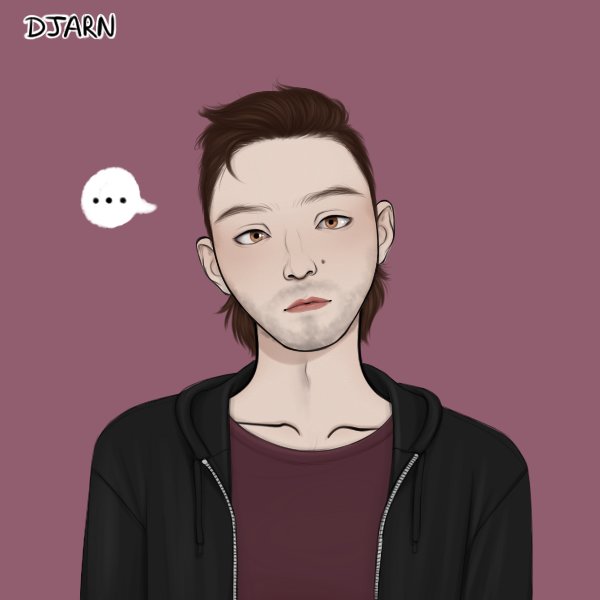

> [!QUOTE|right] The \_\_\_\_ one
> {: .bio-portrait}
> *"Cheesy Quote"*{: .bio-quote}

# **Calvin Snyder**{: .bio-page-title}

## **Bio**{: .bio-section-title}

Though, almost nobody knows his name, everyone at Oak Vale High would recognize Calvin in an instant; he’s “the tall kid” of the school. Standing at 6’4” (and still growing) this awkward, lanky, loner can most often be seen in the technologies wing of the high school.

Calvin is a quiet type, even though he will undergo the occasional bullying, nothing seems to phase him. He’s been called a creep, a freak, and many other horrible things, but he never seems to react, and has never been in a fight. Some think he’s weird, some think he’s creepy, but some think he’s cute and mysterious… but nobody actually knows who he is, or what he’s like. Even where he lives is a bit of a mystery.

The only things that anyone can seem to suss out about Calvin is the following: 
He struggles to stay awake in class, but his grades are still above average.
He’s constantly in the tech wing, building god knows what.
He’s sometimes seen with “weird Japanese comic books.”
He has a deep burly voice and nearly has a full grown beard.
He usually keeps to himself but is always seen walking the halls with a smile.

This year might be a little different for Calvin though, because seemingly out of nowhere he joined the drama class as a last minute swap. Some think it’s because he finally made some friends this last summer, others think it’s to “creep on the exchange student,” but most don’t really care about a guy they know nothing about. But maybe this year Oak Vale will finally learn who Calvin is.

> [!INFO|left] Quick Facts
> - Pronouns: He/him
> - Age: 16
> - Height: 6'4"
> - Fun fact:

## **Main Character Connections**{: .connections-title}

[link](.md) - Blah blah blah

No one... Yet ;)