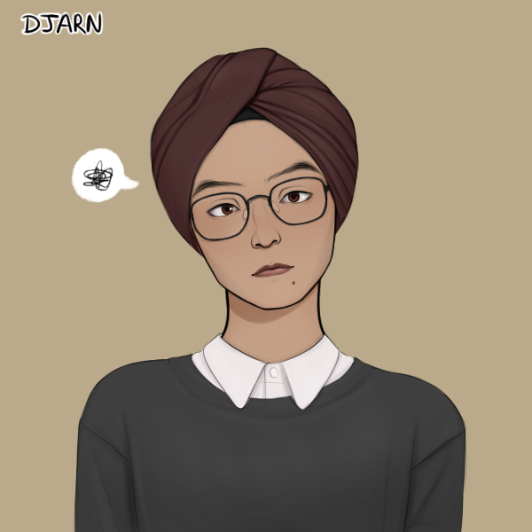

> [!QUOTE|right] The \_\_\_\_ one
> {: .bio-portrait}
> *"Cheesy Quote"*{: .bio-quote}

# **Chandra Modi**{: .bio-page-title}

## **Bio**{: .bio-section-title}

Chandra is the youngest of four siblings (all of whom have since graduated) and feels a lot of pressure to stand out amongst them in the eyes of their parents, not that he lets any of his fellow students know this. He is one of the top students in the school and has a no-nonsense, rather condescending air about him. He seems to have little interest in making friends but is part of just about any extra-curricular that will look good on a college application. 

His one outlet of artistic expression is a notable talent playing the saxophone. He is part of the school band and spends a decent amount of time in the music room practicing. The music teacher, Mr. Stelmanis, is eager to help him develop his skills and is happy to offer him a creative outlet since he can tell Chandra struggles at home. 

> [!INFO|left] Quick Facts
> - Pronouns: He/Him
> - Age: 16
> - Height: 5'4"
> - Fun fact: 

## **Main Character Connections**{: .connections-title}

[Graye](Graye Wilde.md) - Graye sees Chandra as a competitor for [Mr. Stelmanis'](_Adults.md#mr-stelmanis) favour. Unlike Chandra, Graye is not a great student outside of music class and has no real talent for music even though he enjoys listening to and playing it.
