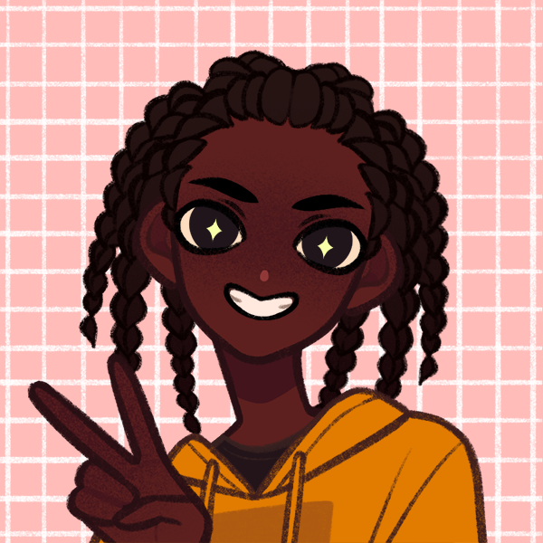

> [!QUOTE|right] The chatty one
> {: .bio-portrait}
> *"Did you know in late stage scurvy symptoms can include all your old scars re-opening because the rate of collagen degradation is greater in an old scar than it is in normal skin and then you just bleed everywhere and die!"*{: .bio-quote}

# **Christopher Halston**{: .bio-page-title}

## **Bio**{: .bio-section-title}

"He's nice enough, and outside of class I get along with him just fine, but gosh, does he ever yap. It's like, he knows I'm visually impaired, right? I need to listen to the instructor in order to actually get anything. Sometimes my voice recordings of class get interrupted by him - it might not even be something related to what we're discussing in class; sometimes it's just a random fact! Like, Chris, wouldn't it be better to talk about this later? Like I said, I do get along with him, but I feel like I'd get along with him even better if he sat someplace else." - Annalise Devin

> [!INFO|left] Quick Facts
> - Pronouns: He/Him
> - Age: 17
> - Height: 5'6"
> - Fun fact:

## **Main Character Connections**{: .connections-title}

[Graye](Graye Wilde.md) - I think Christopher and Graye would share a love of music. Christopher probably heard Graye listening to music from a lesser known band and recognized it, sparking a conversation about other bands they both listen to. It takes Graye a bit to get used to how chatty and upbeat Christopher is, but they enjoy swapping music they like and keeping each other updated about upcoming releases.

[Annalise](Annalise Devin.md) - Talks her ear off in class