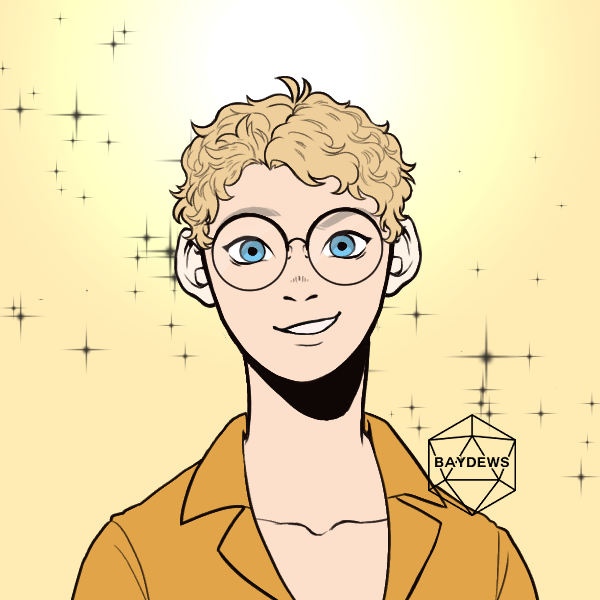

> [!QUOTE|right] The gossip
> {: .bio-portrait}
> *"Promise me you won't tell another soul but I heard..."*{: .bio-quote}

# **NPC Name**{: .bio-page-title}

## **Bio**{: .bio-section-title}

Son of [Flea](_Adults.md#flea-oisin) with no mother in the picture whatsoever, Cleo is a notorious gossip hound. If theres a secret, someone has probably already told him. If you need info fae probably have it.. for a price. In addition to secrets and information Cleo loves to collect trinkets, shiny objects and kisses. He never forgets a debt but has been known to forgive them on occasion. Cleo is strikingly pretty in an ethereal way, wears faer shirts unbottoned just a little too far, and a shameless flirt. His hobbies include: attending various sports practices to admire the atheletes, playing matchmaker, and petty theft.

Cleo gets decent grades and is being tutored in several subjects. Fae get along well with Flea who likes to laugh, shake his head, and say "You're just like your mother kid." to any trouble he gets himself into.

> [!INFO|left] Quick Facts
> - Pronouns: He/Fae
> - Age: 16
> - Height: 6'0" (183cm)
> - Can do a standing backflip and walk around in a handstand

## **Main Character Connections**{: .connections-title}

[Aliya](Aliya Raventhorne.md) Sits behind her in homeroom, constantly pointing out things outside the window and flirting hard enough no one is sure if its for fun or for serious.