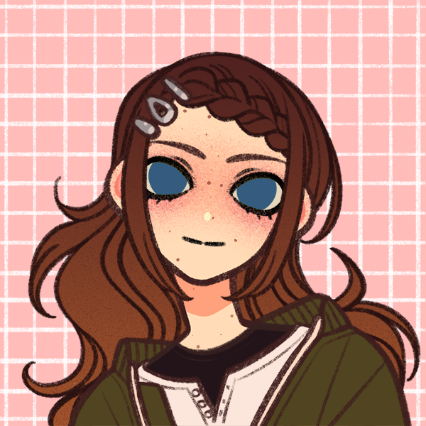

> [!QUOTE|right] The \_\_\_\_ one
> {: .bio-portrait}
> *"Cheesy Quote"*{: .bio-quote}

# **Hana Marin**{: .bio-page-title}

## **Bio**{: .bio-section-title}

She's half Spanish, and she is friends with Christopher and Annalise. Actually, she used to be quite close with Annalise when they were little, but after her accident, Annalise found it a bit difficult to be close to anyone, so they fell a little bit apart. But now they're starting to get closer again. She became friends with Christopher in grade 8 after they were partnered for a science project together. She has two bonsai trees at home which she diligently cares for, and she's also really good at making miniature car models (Annalise: "she let me hold them last time I was at her house; they feel so intricate!") so she's kind of a car guy on her dad's side. Being that Hana is type 1 diabetic, she and Annalise have been bonding lately over the various accommodations they need as disabled students. 

She has been secretly dating [Chris](Christopher.md) but recently pushed him to take the leap and make it not secret anymore.

Can borrow her mom's car on the weekend.

> [!INFO|left] Quick Facts
> - Pronouns: She/Her
> - Age: 17
> - Height: 5'5 1/2" (166.37 cm)
> - Fun fact: Enjoys vintage horror movies

## **Main Character Connections**{: .connections-title}

[Annalise](Annalise Devin.md) - Friends again and grower closer all the time!

[Amy](El Adir.md) - Hooking up on the dl (not cheating)