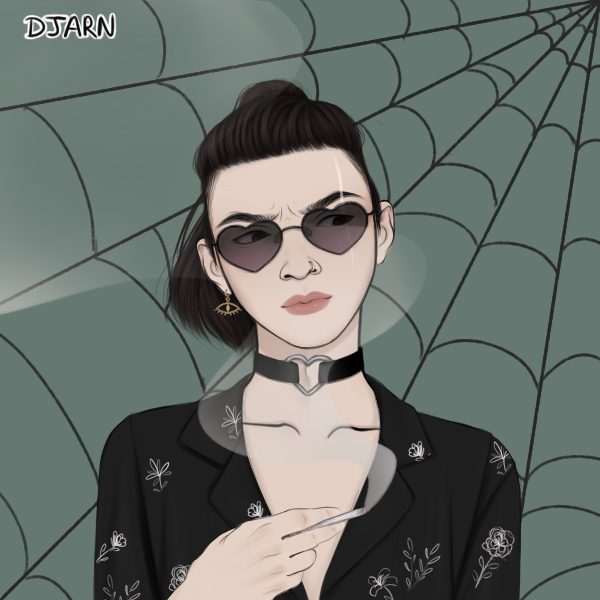

> [!QUOTE|right] The angsty one
> {: .bio-portrait}
> *"I hate this tiny backwards town, I hate this stupid school and its imperialist bootlicker curriculum, and I definitely hate you."*{: .bio-quote}

# **LC**{: .bio-page-title}

## **Bio**{: .bio-section-title}

LC moved to town a few years ago when their [dad](_Adults.md#the-director) became the director of [Brookhaven National Laboratory](Brookhaven National Laboratory.md). From the start they have been.. very vocal about how they feel about this town and its inhabitants, as well as their own parents part in the military industrial complex. Harsh, icy, and intimidatingly cool looking they haven't made many close friends which is fine because no one gets it. LC plays all the instruments in a punk band but wont allow anyone else to join. The name of the band changes too frequently to track. One of the only kids who smokes and has a fake ID they often purchase liquor and are invited to nearly every party as a result. Their [mom](_Adults.md#lcs-mom) moved away suddenly after a whirlwind divorce about a year ago.

They are a good student, failing everything as a protest, don't have any close friends, and have a distant relationship with both parents by choice.

> [!INFO|left] Quick Facts
> - Pronouns: They/Them
> - Age: 17
> - Height: 5'9" (175 cm)
> - No one actually knows how tall LC is without the combat boots on, but its probably not 5'9"

## **Main Character Connections**{: .connections-title}

[Graye](Graye Wilde.md) - ???

[Everette](Everette Eerie.md) - ???