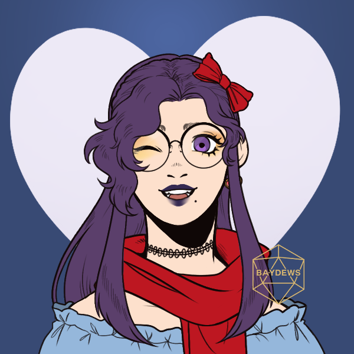

> [!QUOTE|right] The \_\_\_\_ one
> {: .bio-portrait}
> *"Cheesy Quote"*{: .bio-quote}

# **Melody Evermore**{: .bio-page-title}

## **Bio**{: .bio-section-title}
Oldest of 3 kids (sister is Stacy (sometimes called Staccato) and brother is Barry (sometimes called Baritone)), works as a barista, loves space, really great older sister, her family isn't the most well off but they don't really struggle, she's hoping to get into college but also knows things will turn out just fine if she doesn't, so she tends not to worry about it too much

Works at the cafe to build up some cash so that maybe she can go  to school to be an astronaut, but she doesn't quite have the grades to support it, but it doesn't mean she wants to give up on her dreams. Can't believe Izzie made a stereotypical hot flirty transfem barista..

Light and easy going, lil fun/flirty, maybe the kinda girl you don't really ever know what she's thinking because she always acts the same to everyone

Sneaks into the planetarium in Roanoke pretty often on the weekends

> [!INFO|left] Quick Facts
> - Pronouns: She/Her
> - Age: 17
> - Height: 5'11"
> - Fun fact: 

## **Main Character Connections**{: .connections-title}

No one... Yet ;)