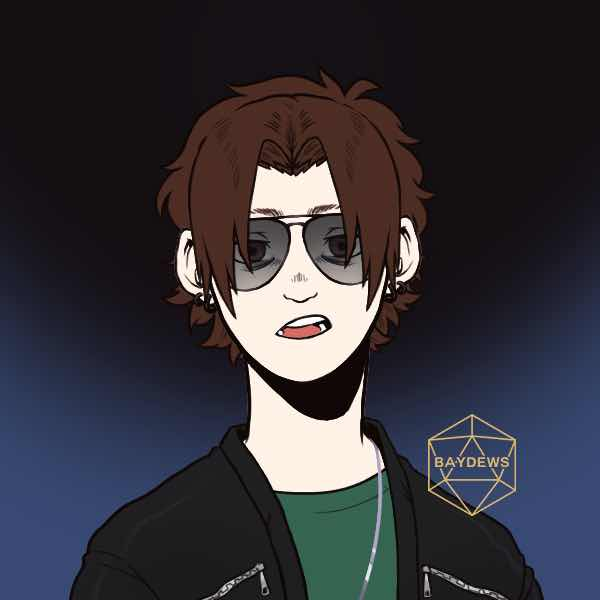

> [!QUOTE|right] The greasy one
> {: .bio-portrait}
> *"Cheesy Quote"*{: .bio-quote}

# **Rod Streeter**{: .bio-page-title}

## **Bio**{: .bio-section-title}

Skinny, pale, greasy hair, always staring at people from afar from underneath his stupid hoody he wears everyday.

Streeter is a bit of a “bad kid” among the Oak Vale vultures. He’s never one to pay attention in class and usually makes it everyone else’s problem. Outside of class however he tends to be a lot more attentive when it comes to his fellow school mates. He’s been called a stalker or a creep many times but everyone knows if you want to buy anything a little less than legal, he’s the guy you talk to. He probably doesn’t have the best home life as he often comes to school with attitude of a rabid dog, and that attitude has gotten him into his fair share of trouble. There isn’t anyone he wouldn’t start a fight with, and there’s hardly a reason he hasn’t already started a fight over. Look at him the wrong way, or say the wrong thing, and you’ll soon find a fist in your face. 

Nobody knows why he’s acted like this before… but everyone knows that ever since Amy showed up something has changed. An eerie calm has taken a hold of Streeter and he can’t seem to stop staring at Amy any chance he has. Some think it’s a weird crush, others think he’s “on the hunt” whatever that means… but whatever the reason, it’s probably not good.

> [!INFO|left] Quick Facts
> - Pronouns: He/Him
> - Age: 18
> - Height: 5'9" (175cm)
> - Fun fact: Will not be graduating, plans to join the merchant marines next year. Does not know what a merchant marine is but is hoping its like a marine and a pirate

## **Main Character Connections**{: .connections-title}

[Amy](El Adir.md) - ???

[Alyssa](Alyssa Merrymont.md) - Strongly dislikes, is jealous over also having a thing for [Melody](Melody Lastname.md)

