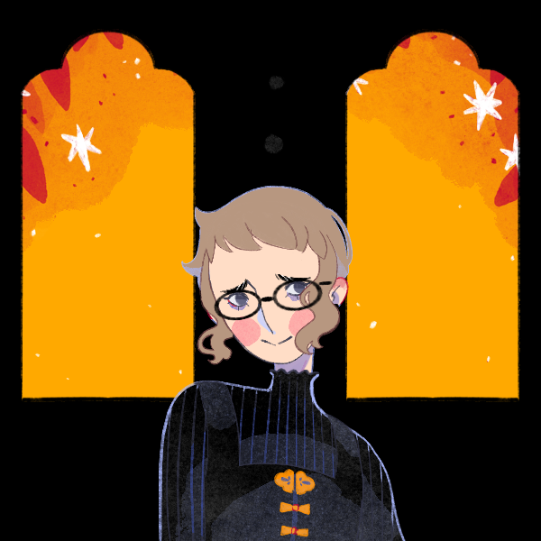

*The truth is out there and I'm going to be the one to find it!*
{ align=right }

**Bio**

Trish has lived in town her whole life. She/Her pronouns, doesn't like to stick with any given sexuality label. She's into journalism as a byproduct of her true hobby: being obsessed with the supernatural. She is fully mortal and has never actually had a supernatural experience, but is always yammering on about Frogmen in [[The Lake]] or the Alien hive in [[The Lab]]. She does her best with the school newspaper and takes it very seriously despite always managing to miss the real point of the story or make the person she is writing about seem really awkward. Junior, decent student, handful of friends, energetic and upbeat even in the face of very direct bullying.

She is a decent student, has a handful of friends, and a good home life.

**Main Character Connections**

[[Aliya Raventhorne]]: Friends from a young age, the two grew apart after sharing a kiss in the 5th grade. Trish tasted like garlic which Aliya hates and became convinced she was a vampire. Trish spent the next several years poking Aliya with silver objects and trying to get her to cross running water and in return was constantly mocked by Aliya. While it has tapered off since High School began, Trish is still sure she's right and has a massive, unrequited, crush on Aliya.