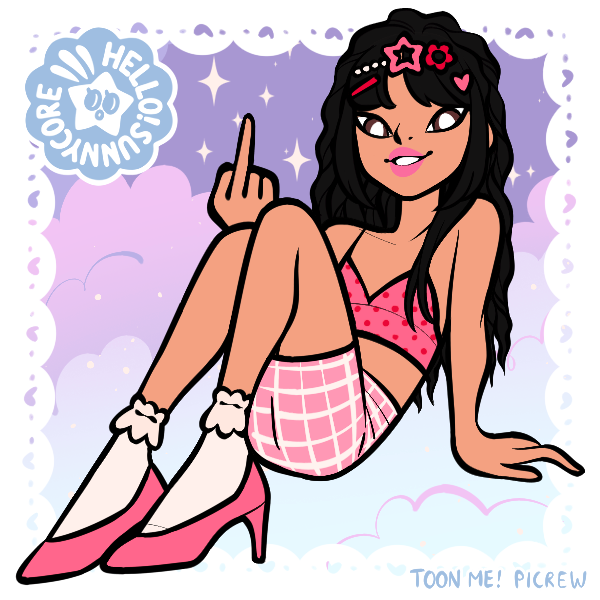

> [!QUOTE|right] The \_\_\_\_ one
> {: .bio-portrait}
> *"Cheesy Quote"*{: .bio-quote}

# **Zelda Crowe**{: .bio-page-title}

## **Bio**{: .bio-section-title}

Also a y2k it girl
Also on the track team, they joined together  in 7th grade and became inseparable 
Her and aliya sort of have a power struggle in their friendship and they’re always trying to one-up each other
Can absolutely play piano. And well.
Competitive diva, but she’s not all bad, she is genuinely compassionate and supportive
So cool. Probably vapes
Very mean to trish, but not like a traditional bully

> [!INFO|left] Quick Facts
> - Pronouns: She/They
> - Age: 16
> - Height: 5'1"1/2 (157cm)
> - Fun fact

## **Main Character Connections**{: .connections-title}

[Annalise](Annalise Devin.md) - "Usually, the shopkeeper at the grocery store rips back the labels of my favourite soup just a bit, so I know which cans to get, but he forgot to when I was shopping last time. Zelda was there and she took the time to help me get the rest of my groceries." :)"

[Aliya](Aliya Raventhorne.md) - Extremely competitive long term friendship